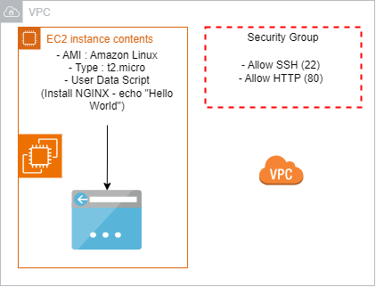

# Terraform AWS EC2 + NGINX Setup

## Objective

Provision an EC2 instance on AWS using Terraform, install NGINX, and configure the web server to display "Hello World" when accessed via the instance's public IP address.

[](terraform.png)

## Table of Contents

1.  [Prerequisites](#prerequisites)
2.  [Steps](#steps)
    *   [Prepare Terraform Configuration](#prepare-terraform-configuration)
    *   [Initialize Terraform](#initialize-terraform)
    *   [Review the Execution Plan](#review-the-execution-plan)
    *   [Apply the Configuration](#apply-the-configuration)
    *   [Access the NGINX Web Server](#Access-the-NGINX-web-server)
    *   [Clean Up Resources](#clean-up-resources)

## Prerequisites

1. **Terraform**: Install Terraform on your local machine or development environment. Follow the installation guide at [Terraform Installation](https://www.terraform.io/downloads.html).

2. **AWS CLI**: Install and configure the AWS CLI with your credentials. Follow the setup guide at [AWS CLI Installation](https://docs.aws.amazon.com/cli/latest/userguide/cli-configure-quickstart.html).

3. **AWS Account**: Ensure you have an AWS account with appropriate permissions to create EC2 instances and associated resources.

4. **SSH Key Pair**: Generate an SSH key pair for accessing the EC2 instance or use an existing key pair. The public key should be accessible to Terraform.

## Steps

### 1. Prepare Terraform Configuration

Create Terraform configuration files to define the infrastructure:

- **`main.tf`**: Configure the AWS provider, EC2 instance, security group, and user data script.
- **`variables.tf`**: Define variables for configurable parameters like instance type, AMI ID, and SSH key.
- **`outputs.tf`**: Define outputs to display the public IP address of the EC2 instance.

### 2. Initialize Terraform

Run the following command in the directory containing your Terraform configuration files to initialize the working directory:

```sh
terraform init
```

### 3. Review the Execution Plan

Generate and review the execution plan to understand the changes Terraform will make:

```sh
terraform plan
```

### 4. Apply the Configuration

Apply the Terraform configuration to provision the infrastructure. Confirm the action when prompted:

```sh
terraform apply
```

### 5. Access the NGINX Web Server

After Terraform completes the provisioning, it will output the public IP address of the EC2 instance. Use this IP address to access the NGINX web server in your web browser:

```sh
http://<instance_public_ip>
```

You should see a "Hello World" page served by NGINX.

### 6. Clean Up Resources

To remove all resources created by Terraform, run:

```sh
terraform destroy
```

Confirm the destruction of resources when prompted.

